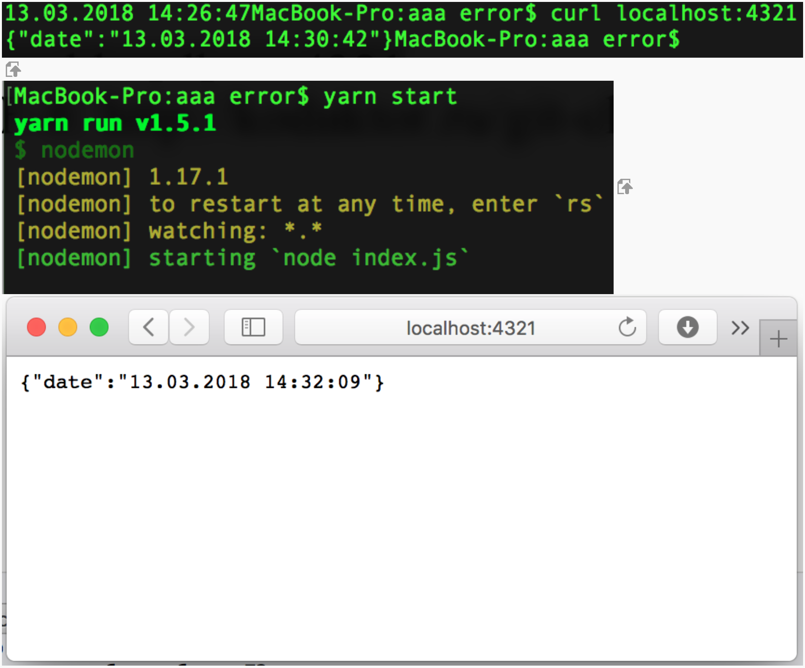
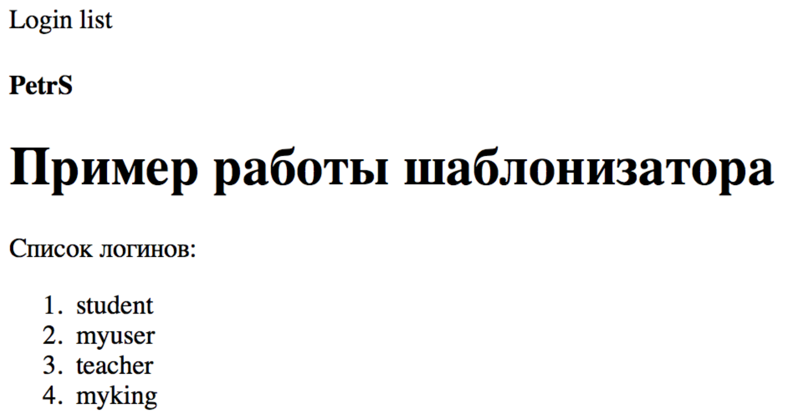
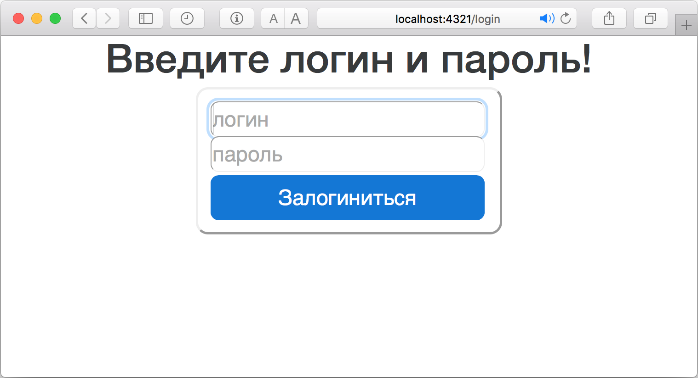
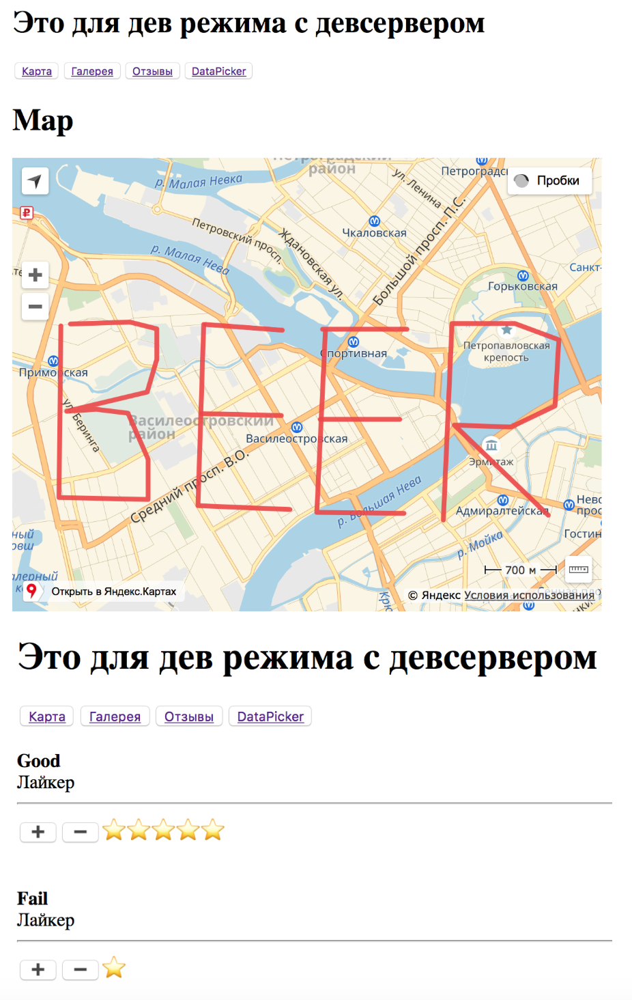
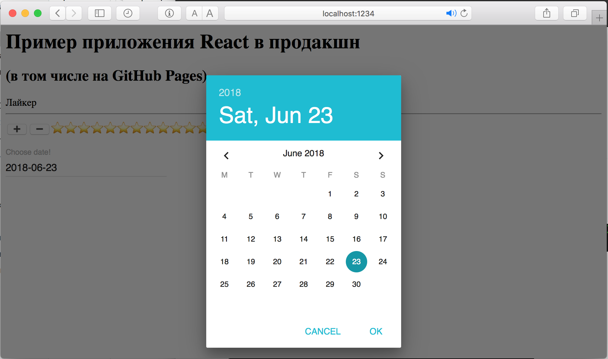
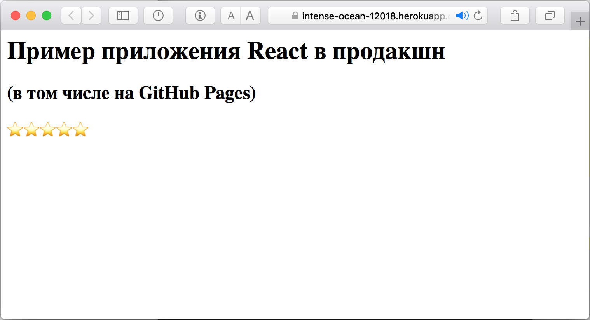
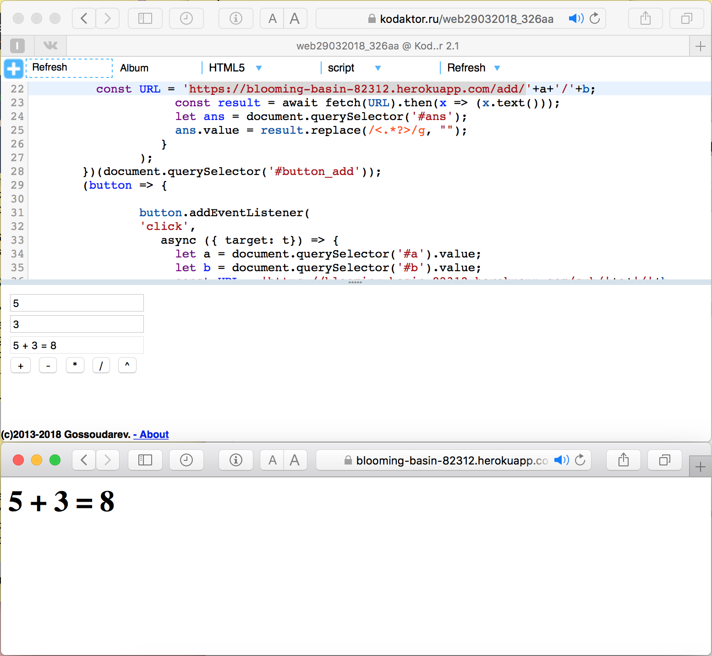
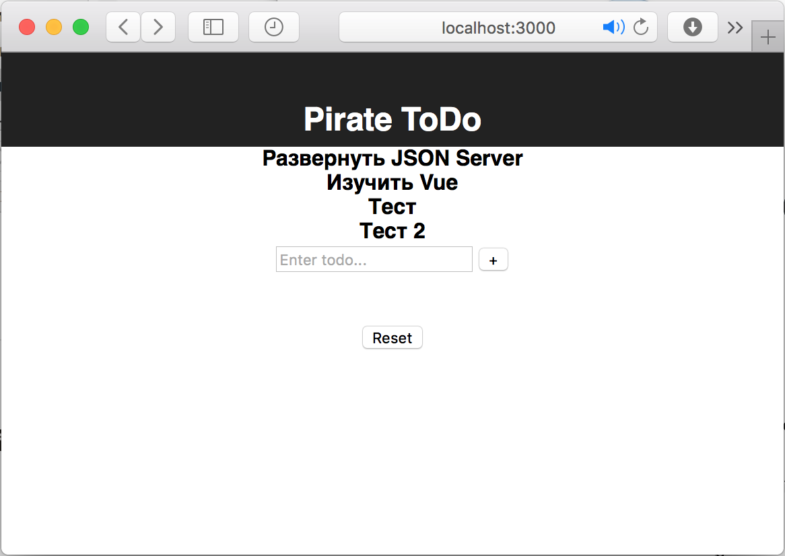
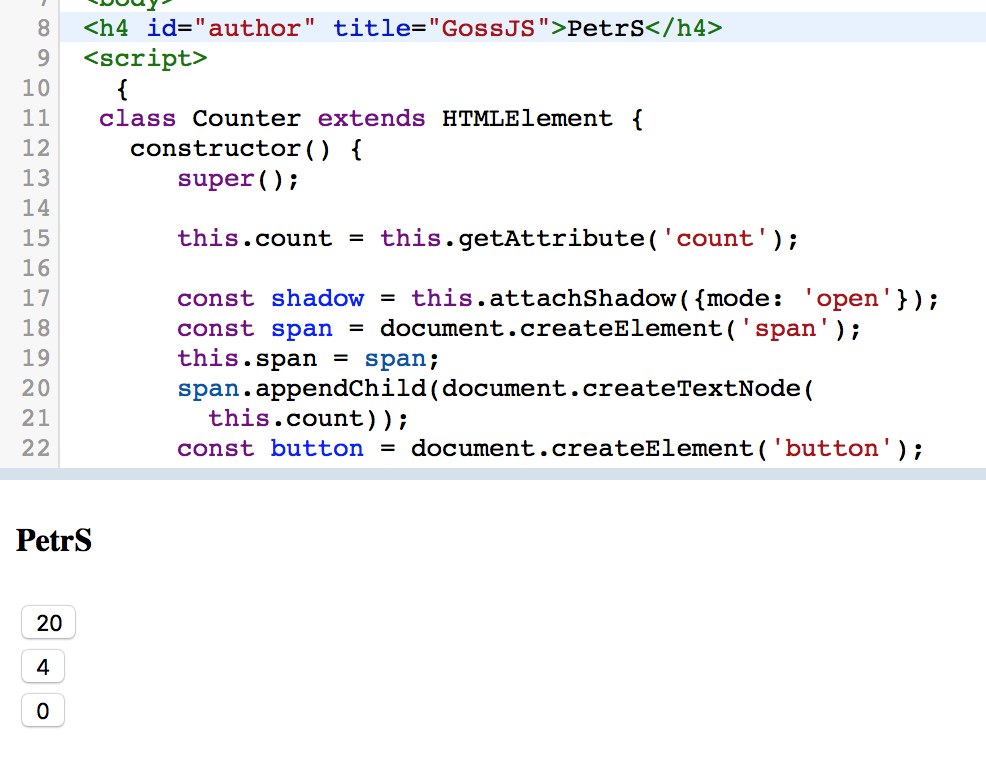

# Портфолио -  КП2018

## 13.03.2018 (Простой веб-сервер в Node)
#### [Ссылка](https://github.com/AnotherStudent/js_server)
#### Скриншот

## 20.03.2018 (Express)
#### [Ссылка](https://github.com/AnotherStudent/js-express-server)
#### Скриншот

## 17.04.2018 (сессии в Express)
#### [Ссылка](https://github.com/AnotherStudent/autism)
#### Скриншот

## 08.05.2018 (клиентский роутер + Material design)
#### [Ссылка 1](https://github.com/AnotherStudent/cli-route)
#### [Ссылка 2](https://github.com/AnotherStudent/material-ui)
#### Скриншоы

## Приложения на Heroku
#### [Первое](http://protected-mesa-39267.herokuapp.com/hello)
#### [Второе](https://intense-ocean-12018.herokuapp.com)
#### Скриншот

## Клиент-Сервер на Heroku
#### [Сервер](https://blooming-basin-82312.herokuapp.com/add/2/3)
#### [Клиент](https://kodaktor.ru/web29032018_326aa)
#### Скриншот

## TODO
#### [Ссылка](https://github.com/AnotherStudent/PirateToDo)
#### Скриншот

---

## Bind
#### [Ссылка](https://kodaktor.ru/bind02032018_87954)

## Counter
#### [Ссылка](https://kodaktor.ru/8db0e91)
#### Скриншот

