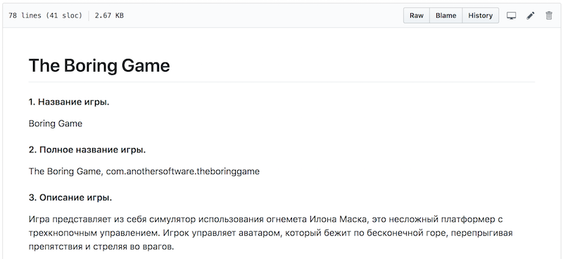

# Портфолио - УПП

## Диаграмма гранта
#### [Ссылка](https://github.com/ctel-prj-mng/1-gantt-60218-AnotherStudent)
#### Скриншот

## Прототип игры
#### [Ссылка](https://github.com/AnotherStudent/BoringGamePrototype)
#### Скриншот

## Техническое задание
#### [Ссылка](https://github.com/ctel-prj-mng/3-tz-200218-AnotherStudent/blob/master/requirments.md)
#### Скриншот

## Scrum presentation
#### [Ссылка](https://github.com/ctel-prj-mng/4-scrum-060318-avokado/blob/master/index.html)
#### Скриншот

## UML диаграмма
#### [Ссылка](https://github.com/ctel-prj-mng/7-uml-270318-AnotherStudent/blob/master/ANSWER.md)
#### Скриншот

## Тестирование сайта
#### [Ссылка](https://docs.google.com/document/d/1RAedobM_Ec8fT3Yi8eqNhqWIA2X7pDgqqZLSy1V4yWw/)
#### Скриншот

## Презентация проекта

